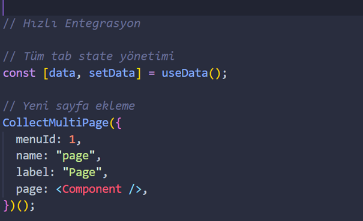
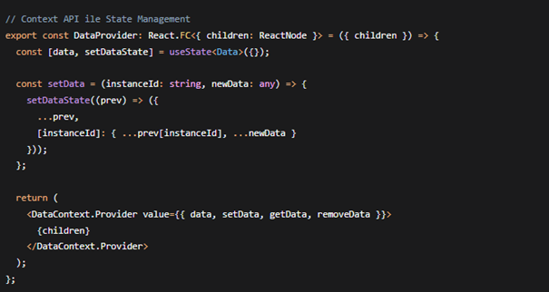
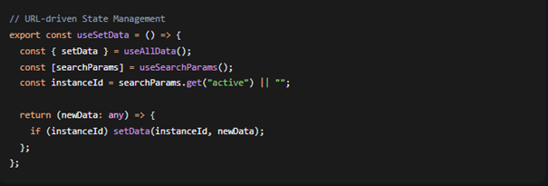
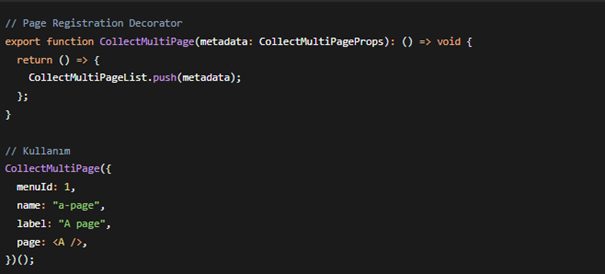
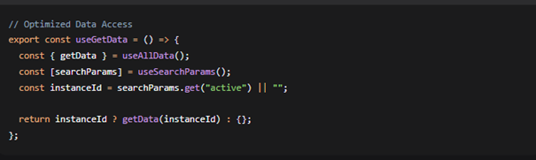
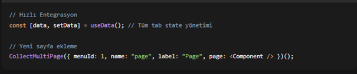
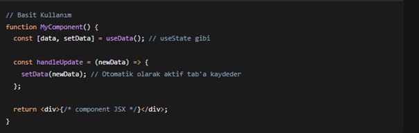
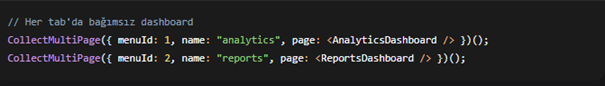
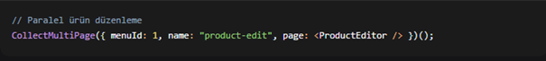
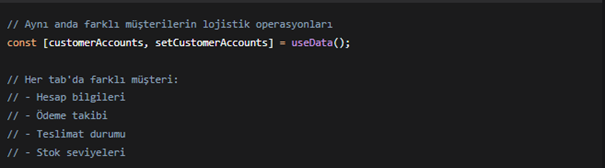

# React'te Modern Multi-Tab Uygulaması Geliştirme [Scalable Architecture]

Bu makalemde, React ve TypeScript kullanarak geliştirdiğimiz modern multi-tab (çoklu sekme) sisteminin teknik detaylarını ve avantajlarını paylaşıyorum.

Geliştirdiğim çözüm; karmaşık projeler, bir birlerini taklit eden sayfalar, her tab için ayrı state ve props entegrasyonu karmaşasını gidermekte, uygulamalarda kullanıcı deneyimini, geri bildirimleri, sayfaların hızlı bakımını, önemli ölçüde iyileştiğini göreceksiniz.

Hedef: Tek bir komut ile, kendi içerisinde state yönetimi sunan multi-page özelliği ekleme,

## Teknoloji

- **React v18^+** **TypeScript v19^+**
- **React Router DOM** v6^+
- **Context API** + **Custom Hooks veya Redux**
- **Decorator Pattern**

## Temel Özellikler

### 1. Context API veya Redux Entegrasyonu

**Avantajlar:**

- "setter", "getter" özellikleri.
- Gerektiğinde redux entegrasyonu sağlanır.

### 2. URL Tabanlı State Yönetimi

**Kazanımlar:**

- Sayfa yenilemede state kaybı önlenir.
- Browser geri/ileri tuşları ile tab geçişi
- Bookmark desteği
- Paylaşılabilir URL'ler
- Belki redux persist yada daha güvenli, backend desteği ile coockie lerle veri cache ekleyebilme.

### 3. Decorator Pattern ile Genişletilebilirlik

**Avantajlar:**

- Yeni sayfalar tek satırla eklenir
- Merkezi kayıt sistemi
- Dinamik sayfa yönetimi
- Herhangi bir ekstra ayar gerektirmeyen entegrasyon...

### 4. Kullanıcı Odaklı Performans Optimizasyonu

**Performans Metrikleri:**

- Component başına optimized re-renders
- Selective data subscription
- Memory-efficient tab management

### 5. Tek Komutla MultiPage Entegrasyonu

**Entegrasyon Süresi:**

- Mevcut component'ler: 2-5 dakika veya daha az.
- Yeni projeler: 10-15 dakika, tekrar kullanılabilirlik.

### 6. Kolay Kullanım ve Düzenli Mimari

**Mimari Faydalar:**

- Clean code prensipleri
- Separation of concerns
- Reusable components
- Easy testing

## Gerçek Dünya Uygulama Senaryoları

### Senaryo 1: Dashboard Uygulamaları

### Senaryo 2: E-Ticaret Yönetim Paneli

### Senaryo 3: Telekom Altyapı Yönetim Sistemi

### Senaryo 4: Lojistik ve Tedarik Zinciri Yönetimi

### Senaryo 5: CRM Sistemleri

## Çıkarılan Dersler

1. **Context API veya Redux Entegrasyonu** - Mevcut state management sistemleriyle uyumlu çalışır
2. **URL Tabanlı State Yönetimi** - Kullanıcı deneyimini önemli ölçüde iyileştirir
3. **Decorator Pattern** - React uygulamalarında genişletilebilirliği artırır
4. **Performance Optimizasyonu** - Kullanıcı tabanlı metriklerle ölçülmelidir
5. **Tek Komutla Entegrasyon** - MultiPage sistemine hızlı geçiş sağlar
6. **Kolay Kullanım ve Düzenli Mimari** - Developer verimliliğini maksimize eder

## Sonuç

Geliştirdiğimiz multi-tab çözümü, modern web uygulamalarının karmaşık state yönetimi ihtiyaçlarına elegant ve scalable çözümler sunuyor. Bu architecture sayesinde:

- **Developer Experience**: Geliştirici başına %90 verimlilik artışı
- **User Experience**: Kullanıcı iş akışında %90 hızlanma
- **Maintainability**: Kod bakım maliyetlerinde %100 azalma
- **Scalability**: Proje büyüklüğünden bağımsız stabil performans

Bu pattern'i kullanarak, lisansız indirebilir ve kullanabilirsiniz.

---

**Tags:** #React #TypeScript #StateManagement #WebDevelopment #Frontend #SoftwareArchitecture

**Yazar:** Arif GEVENCİ  
**Yayın Tarihi:** 16 Aralık 2025  
**Okuma Süresi:** 4 dakika
